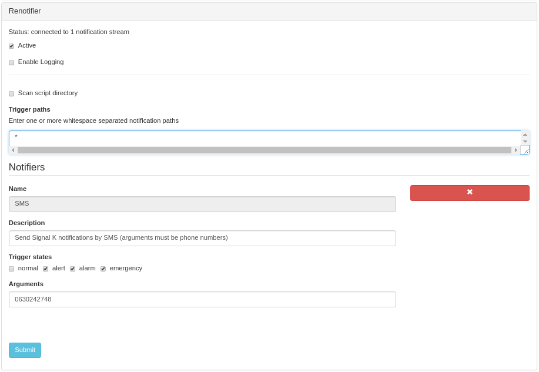

# signalk-renotifier

[Signal K Node server](https://github.com/SignalK/signalk-server-node)
plugin which executes arbitrary external scripts in response to system
notifications.

The plugin was developed to provide a remote notification service and although
this functional role determines the syntax of external script invocation it
does not place arbitrary constraints on what a script can do.

This documentation takes as a case study the use of __signalk-renotifier__ to
implement a simple SMS-based notification service.

### Principle of operation

__signalk-renotifier__ processes
[Signal K notifications](http://signalk.org/specification/1.0.0/doc/notifications.html),
responding to just those notifications identified in the plugin configuration
and hereafter called _trigger paths_.
When a notification is received on a trigger path, the plugin presents a
_notification opportunity_ to one or more configured _notifiers_ each of which
determines, based upon its configuration, whether or not to execute its
associated _notification script_.
 
## System requirements

__signalk-renotifier__ has no special system requirements that must be met
prior to installation.

Of course, for the plugin to actually _do_ anything it requires one or more
notification scripts, each of which may well place quite demanding requirements
on the host server's software, hardware and operating environment.

_Sending an SMS from a computer requires that the system has access to a
cellular modem (or a mobile phone that supports remote control) and a software
stack that can make this hardware operate in a meaningful way._

_My hardware consists of a permananently attached Huawei E353 USB cellular
modem (purchased on Ebay for a few Euros) connected to a (probably unnecessary)
external antenna (purchased from a chandler for many tens of Euros)._

_The software I use to access my cellular modem is
[Gammu](https://wammu.eu/gammu/)
which is part of most modern Linux distributions._

## Installation

Download and install __signalk-renotifier__ using the _Appstore_ link
in your Signal K server console.
The plugin can also be obtained from the 
[project homepage](https://github.com/preeve9534/signalk-renotifier)
and installed using
[these instructions](https://github.com/SignalK/signalk-server-node/blob/master/SERVERPLUGINS.md).

The plugin ships with some example notifier scripts for sending Email and
SMS text messages.
These are located in the `examples/` folder of the plugin install directory
and if required must be copied or linked into the `bin/` folder.

_For cellular modem support, install _gammu_ on your Signal K Node server
host using your system's package manager, or download and install a suitable
version from the
[gammu download page](https://wammu.eu/download/gammu/)._

## Usage


 
### Activating the plugin

In the server main menu navigate to _Server->Plugin config_ and select
_Renotifier_ to access the plugin configuration screen.
Check the _Active_ option, then review and amend the configuration options
discussed below before clicking the _Submit_ button to start the plugin.

__signalk-renotifier__ will have automatically populated its list of
notifiers by scanning scripts in the plugin's `bin/` folder.

### Customising plugin operation

The plugin configuration page at _Server->Plugin config->Renotifier_ offers
the following configuration options.

__Scan script directory__  
Checkbox requesting that the list of _Notifiers_ (see below) be re-built by
scanning the plugin's `bin/` folder for executable scripts.
The _Notifiers_ list is created when the plugin first executes so if new
notifier scripts are added this option must be invoked.
Check this option to re-initialise the list of notifiers (any configuration of
existing entries in _Notifiers_ will be retained).

__Trigger paths__  
List of the __Signal K Node__ pathnames which should be monitored by the plugin.
Default is '*' (monitor all paths).
Enter here a list of whitespace separated (newline works best) Signal K paths,
without the 'notifications.' prefix.
Pathnames can include a terminal asterisk which will cause all paths in the
indicated part of the tree to be monitored. 
For example, if notifications are being raised in the system when the level of
waste in the black water tank exceeds some threshold, then entering a string
of the form "tanks.wasteWater.0.currentLevel" will cause the plugin to look
out for notifications on this data point only whilst "tanks.*" would select
notifications related to all tanks.
 
__Notifiers__  
List of notifier (scripts) and their options.
Default is the list of all notifier scripts in the `bin/` folder in the
plugin's installation directory.
Entries in the list can be deleted and the list can be re-built (by re-scanning
the `bin/` folder) using the _Scan script directory_ option described above.
Each notifier in the list can be configured through the following options.

__Name__  
The name of the notifier (actually the filename of the notifier script in the
plugin's `bin/` directory).
This option cannot be changed.

__Description__  
A short description of the notifier (as reported by the notifier script when
run with no arguments).
This option cannot be changed and should explain what values the notifier
script will accept for the _Arguments_ option (see below).

__Arguments__  
A comma or space separated list of values which should be passed to the notifier
script as arguments.
The default value is no arguments and the system will accept a maximum of
eight arguments.
The meaning of these values is script dependent (see _Description_ above),
but for scripts which implement some kind of communication these will likely
indicate the recipient(s) of the notification.
For example, in the case of the `SMS` notifier script included in the plugin
distribution this option should contain a list of the cellphone numbers
to which notification texts should be sent.

__Trigger states__  
The notification states which should cause execution of the notifier script.
The default value is to not trigger at all.
Check the notification states which should cause the notifier script to
execute when a notification appears on one of the _Trigger paths_.

__Execution mode__  
The mode in which the plugin should execute this notifier.
Options are "normal" (execute notifier script without exhaustive logging),
"log" (execute notifier script and log every invocation) and "test"
(do not execute notifier script, but do log the invocation).

### Notifier scripts

Notifier scripts are shell scripts or executables located in the `bin/`
folder under the plugin installation directory.
Scripts must be executable by the owner of the running Signal K Node server and
must implement the following interface.

_script_ [_arg_ ...]

Where _script_ is the name of the script file and _arg_ is an argument of a type
dependent upon script function (see above).

During plugin initialisation __signalk-renotifier__ will execute _script_ with
no arguments in order to obtain some descriptive text that can be used in the
plugin configuration page.
It is helpful if this text offers some advice on what types of _arg_ values
_script_ can handle.
An exit value of 0 must be returned from this call.

The `SMS` script, for example, behaves in the following way:
```
$> SMS
Send notifications as SMS text messages (arguments must be telephone numbers)
$>
```
Normally, execution of _script_ will happen when a notification event occurs
that matches _script_'s configuration criteria and __signalk-renotifier__ will
pass the text of the notification message via _script_'s standard input and all
configured arguments as a space separated _arg_ values.

The `SMS` script, for example, requires its arguments to be telephone numbers
and so the command:
``
echo "Hello!" | SMS 00447786119911
``
will attempt to send a simple text message to the supplied phone number.

When _script_ is executed with one or more _args_ it must operate in the
following way.

1. If _script_ cannot attempt to perform its function for whatever reason
then it must emit a short explanatory reason for the problem on stderr and
terminate with exit value 1.
Typical reasons might be "required hardware not available", "program 'foo'
is required but cannot be found" or "no message on standard input".

2. _script_ should then iterate over its _args_, attempting to perform whatever
action is intended.
A basic algorithm for managing this process and ensuring a meaningful error
code value for _script_ is shown below.
```
exitcode = 0
for (i = 0; i < args.length; i++) {
	failed = perform operation
	exitcode += (failed)?(2 ^ i):0
}
return (exitcode + 256)
```

3. In the case of failures which occur whilst iterating over _args_, _script_
should issue a message on stderr which attempts to report the reason(s) for
failure. 

4. As far as possible _script_ should limit unnecessary resource consumption.
The `SMS` script, for example, abandons attempts to process all its arguments
as soon as it detects that a cellular network is unavailable.

The `SMS` script installed with the plugin is listed below.

```
```

## Notifications, warnings and errors

## Version history

__1.0.0 November 2018__
First release.

## License

__signalk-renotifier__ is released under Apache License 2.0.
